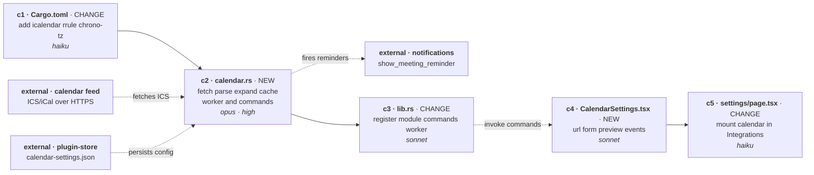

```mermaid
flowchart LR
  ext1["<b>external · calendar feed</b><br/>ICS/iCal over HTTPS"]
  ext2["<b>external · notifications</b><br/>show_meeting_reminder"]
  ext3["<b>external · plugin-store</b><br/>calendar-settings.json"]

  c1["<b>c1 · Cargo.toml</b> · CHANGE<br/>add icalendar rrule chrono-tz<br/><i>haiku</i>"]
  c2["<b>c2 · calendar.rs</b> · NEW<br/>fetch parse expand cache<br/>worker and commands<br/><i>opus · high</i>"]
  c3["<b>c3 · lib.rs</b> · CHANGE<br/>register module commands worker<br/><i>sonnet</i>"]
  c4["<b>c4 · CalendarSettings.tsx</b> · NEW<br/>url form preview events<br/><i>sonnet</i>"]
  c5["<b>c5 · settings/page.tsx</b> · CHANGE<br/>mount calendar in Integrations<br/><i>haiku</i>"]

  c1 --> c2
  c2 --> c3
  c3 -.->|"invoke commands"| c4
  c4 --> c5
  ext1 -.->|"fetches ICS"| c2
  ext3 -.->|"persists config"| c2
  c2 -.->|"fires reminders"| ext2
```
